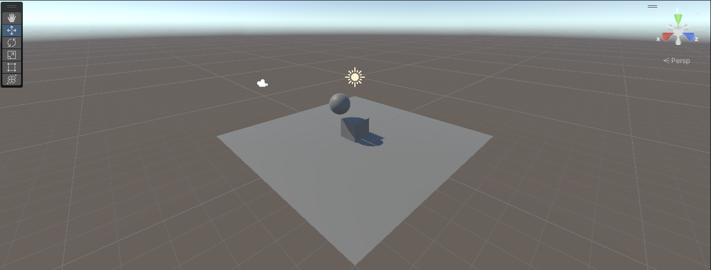

# Ejercicios Físicas 3D

## Descripción del trabajo realizado

### Situación 1

El plano no es un objeto físico. El cubo es un objeto físico y la esfera no. En este caso, el plano y la esfera sólo tendrán collider, mientras que el cubo debe tener Rigidbody.

- El plano y la esfera tienen solo Collider, por lo tanto, son objetos estáticos. No interactúan físicamente (no responden a fuerzas ni movimientos). Sin embargo, tiene una forma que define cómo colisiona con otros objetos.
- El cubo tiene Rigidbody, lo que significa que es un objeto físico, afectado por la gravedad y colisiones.

### Situación 2

El plano no es un objeto físico. El cubo es un objeto físico y la esfera también. En este caso, el plano sólo tendrán collider, mientras que el cubo y la esfera deben tener Rigidbody.

- Similar a la situación 1, pero ahora tanto el cubo como la esfera tienen Rigidbody, por lo que ambos son objetos físicos y responden a la gravedad y colisiones. No obstante, el plano no se verá afectado por la gravedad, pero podrá colisionar con otros objetos.

### Situación 3

El plano no es un objeto físico. El cubo es un objeto físico y la esfera es cinemática. En este caso, el plano sólo tendrán collider, mientras que el cubo y la esfera deben tener Rigidbody esta última cinemático.

- El plano sigue siendo estático y capaz de colisionar con el resto de objetos. El cubo sigue siendo afectado por la gravedad y las colisiones. A diferencia de la situación anterior, la esfera es un `Rigidbody cinemático`, es decir, sigue colisionando con otros objetos, pero no reacciona a esas colisiones (no recibe fuerzas), ya que sus movimientos no son controlados por el motor de física.

### Situación 4

El plano es un objeto físico. El cubo es un objeto físico y la esfera es física. En este caso, todos los objetos deben tener Rigidbody.

- Todos los objetos, incluido el plano, tienen Rigidbody. Ahora, todos son objetos físicos, por lo que el plano también se comportará como un cuerpo que puede colisionar y ser afectado por la gravedad. Es por ello que podemos apreciar que todos los objetos caen al vacío.

### Situación 5

El plano es un objeto físico. El cubo es un objeto físico y la esfera es física con 10 veces más masa que el cubo. En este caso, todos los objetos deben tener Rigidbody.

- La masa de la esfera varía en comparación con el cubo (10 veces superior). Esto afecta cómo interactúan los objetos en las colisiones. La esfera, al tener más masa, tendrá más inercia y será más difícil moverla comparado con el cubo. Sin embargo, no afecta la velocidad con la que esta cae al vacío, ya que no hemos añadido fricción o resistencia al mismo.

### Situación 6

El plano es un objeto físico. El cubo es un objeto físico y la esfera es física con 100 veces más masa que el cubo. En este caso, todos los objetos deben tener Rigidbody.

- La masa de la esfera varía en comparación con el cubo (100 veces superior). Esto afecta cómo interactúan los objetos en las colisiones. La esfera, al tener más masa, tendrá más inercia y será más difícil moverla comparado con el cubo. Sin embargo, no afecta la velocidad con la que esta cae al vacío, ya que no hemos añadido fricción o resistencia al mismo. **En la animación ocurre lo mismo que en la escena 5**.

### Situación 7

El plano es un objeto físico. El cubo es un objeto físico y la esfera es física con fricción. En este caso, todos los objetos deben tener Rigidbody.

- Se introduce la fricción en la esfera. La fricción influirá en cómo se desliza sobre el plano y en su interacción con otros objetos. Una mayor fricción provoca movimientos más lentos y mayor resistencia al deslizamiento.

### Situación 8

El plano es un objeto físico. El cubo es un objeto físico y la esfera no es física y es Trigger. En este caso, todos los objetos deben tener Rigidbody.

- La esfera no es física, pero está marcada como Trigger, lo que permite detectar colisiones sin interactuar físicamente (el cubo o plano pueden atravesarla sin afectar sus movimientos). No obstante, esta no se verá controlada por el motor de físicas.

- Cuando se activa la propiedad isKinematic en el Rigidbody de la esfera, esta ya no se mueve por las fuerzas físicas, pero aún puede moverse usando transformaciones (por ejemplo, animaciones o código).

### Situación 9

El plano es un objeto físico. El cubo es un objeto físico y la esfera es física y es Trigger. En este caso, todos los objetos deben tener Rigidbody.

- La esfera es física y también es Trigger. Aunque es afectada por las fuerzas físicas, puede atravesar otros objetos sin bloquearse. Además, puede desencadenar eventos al hacerlo, es decir detecta dichas "colisiones" sin tener que reaccionar a ellas.

## Conclusiones

1. Rigidbody (cuerpo rígido):
- Un objeto con Rigidbody se convierte en parte activa de la simulación física y responde a fuerzas como la gravedad y colisiones. Unity calcula su movimiento automáticamente.
2. Collider (colisionador):
- Un objeto con Collider tiene una forma que define cómo colisiona con otros objetos. Puede ser una caja, esfera, cápsula o una malla más compleja.
- Un Collider sin Rigidbody se considera estático, útil para elementos que no necesitan moverse, como el suelo o paredes.
- Un Collider dinámico es aquel que está ligado a un objeto con Rigidbody, lo que permite que se mueva y colisione de manera realista con otros objetos.
3. Kinematic (cinemático):
- Cuando se activa la propiedad isKinematic en un Rigidbody, el objeto ya no se mueve por las fuerzas físicas, pero aún puede moverse usando transformaciones (por ejemplo, animaciones o código).
- Un Rigidbody cinemático sigue colisionando con otros objetos, pero no reacciona a esas colisiones (no recibe fuerzas), ya que sus movimientos son manuales y no por el motor de física.
4. Trigger:
- Un Trigger hace que no se produzcan colisiones físicas. Es decir, un objeto puede atravesarlo sin bloquearse, pero aún puede detectar la entrada o salida de otros objetos a través de eventos como OnTriggerEnter.
- Ideal para zonas de activación o detección de eventos, donde no es necesaria una colisión física, como áreas de interacción.
