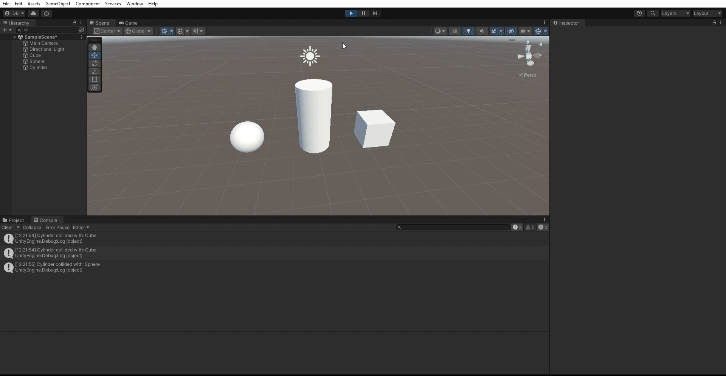

# Ejercicios Físicas 3D
## Descripción del trabajo realizado

### Ejercicios realizados

1. Agrega un campo velocidad a un cubo y asígnale un valor que se pueda cambiar en el inspector de objetos. Muestra la consola el resultado de multiplicar la velocidad por el valor del eje vertical y por el valor del eje horizontal cada vez que se pulsan las teclas flecha arriba-abajo ó flecha izquierda-derecha. El mensaje debe comenzar por el nombre de la flecha pulsada.

    1. Se ha creado la clase `CubeSpeed` con el atributo público `Speed` (modificado desde el inspector) y los atributos privados `_horizontalMovement` y `_verticalMovement`. En estos últimos dos atributos almacenaremos el resultado de la llamada a `Input.GetAxis("Horizontal")` o `Input.GetAxis("Vertical")` según corresponda. Estos retornarán un valor entre [-1, 1].

  

2. Mapea la tecla H a la función disparo.
  Ayuda: Utiliza el Input Manager para redefinir el mapeo por defecto en los controladores.

    1. Para redefinir el mapeo a la función disparo vamos a **Edit > Project Settings > Input Manager** y modificamos `Positive button`.

  

3. Crea un script asociado al cubo que en cada iteración traslade al cubo una cantidad proporcional un vector que indica la dirección del movimiento: moveDirection que debe poder modificarse en el inspector. La velocidad a la que se produce el movimiento también se especifica en el inspector, con la propiedad speed. Inicialmente la velocidad debe ser mayor que 1 y el cubo estar en una posición y=0. En el informe de la práctica comenta los resultados que obtienes en cada una de las siguientes situaciones:

  

  a. Duplicas las coordenadas de la dirección del movimiento.

      La animación no se diferencia de la anterior puesto que en el script utilizamos el método `normalized` para el atributo `moveDirection` con la finalidad de evitar comportamientos inesperados.

  b. Duplicas la velocidad manteniendo la dirección del movimiento.

      Podemos apreciar que la velocidad de movimiento es ligeramente superior (4 unidades).

  

  c. La velocidad que usas es menor que 1.

      Podemos apreciar que la velocidad de movimiento es notablemente menor (0.5 unidades).

  

  d. La posición del cubo tiene y>0.

      Esta restricción no afecta el comportamiento del cubo en la animación en cuanto a su velocidad o dirección.

  e. Intercambiar movimiento relativo al sistema de referencia local y el mundial.
  
      Podemos apreciar que en la primera animación estamos utilizando el sistema de referencia mundial y por tanto el desplazamiento ocurre teniendo en cuenta en eje X del mundo y no del objeto en sí mismo. Mientras que, en la segunda animación estamos teniendo en cuenta el eje X del objeto en sí. Es por ello que, a pesar de tener los mismos parámetros de inicio, la animación tiene resultados diferentes.

- Space.World

  

- Space.Self

  

4. Mueve el cubo con las teclas de flecha arriba-abajo, izquierda-derecha a la velocidad speed. Cada uno de estos ejes implican desplazamientos en el eje vertical y horizontal respectivamente. Mueve la esfera con las teclas w-s (movimiento vertical) a-d (movimiento horizontal).

    1. Script `ArrowController` y `AWSDController`. Se ha utilizado el método `Input.GetKey` para detectar cuando se pulse alguna de las teclas elegidas y `transform.Translate` para mover los objetos (RigidBody cinemáticos) en la escena. No se ha usado `Time.DeltaTime` por propósitos educativos, ya que se exige en el siguiente ejercicio.

  

5. Adapta el movimiento en el ejercicio 4 para que sea proporcional al tiempo transcurrido durante la generación del frame.

    1. Ahora al momento de invocar `transform.Translate` se ha tenido en cuenta `Time.DeltaTime`.

  

6. Adapta el movimiento en el ejercicio 5 para que el cubo se mueva hacia la posición de la esfera. Debes considerar, que el avance no debe estar influenciado por cuánto de lejos o cerca estén los dos objetos.

    1. Se ha normalizado el vector utilizando el método `normalized` y se ha mantenido la coordenada "Y" igualada a 0.

  

7. Adapta el movimiento en el ejercicio 6 de forma que el cubo gire hacia la esfera. Realiza pruebas cambiando la posición de la esfera mediante las teclas awsd.

    1. Respecto al escenario anterior se ha añadido el uso del método `LookAt` y se ha creado el atributo público `objectToFollow`.

  

8. Utilizar el eje “Horizontal” para girar el objetivo y que avance siempre en la dirección hacia adelante.

    1. Se ha utilizado el método `transform.Rotate` y la propiedad `transform.forward`. Asimismo, se ha usando el sistema de referencia mundial `Space.World`.

  

9. Configura el cilindro como un objeto físico, cuando el cubo o la esfera colisionen con él se debe mostrar un mensaje en consola con la etiqueta del objeto que haya colisionado.

    1. Se ha implementado el método `void OnCollisionEnter(Collision collision)` de modo que imprime en pantalla el tag del objeto con el que se ha producido la colisión.

  

10. Configura el cubo como un objeto cinemático y la esfera como un objeto físico. Adapta los scripts del ejercicio 9 para obtener el mismo comportamiento.

    1. No ha sido necesario modificar el script anterior para obtener el mismo resultado.

  

11. Configura el cilindro como un objeto de tipo Trigger. Adapta los scripts de los ejercicios anteriores para obtener el mismo comportamiento.

    1. Se ha implementado el método `void OnTriggerEnter(Collider other)` de modo que imprime en pantalla el tag del objeto con el que se ha producido la colisión.

  

12. Agrega un cilindro de un color diferente al que ya hay en la escena y configúralo como un objeto físico. Selecciona un conjunto de teclas que te permitan controlar su movimiento por la escena y prográmale un movimiento que permita dirigirlo hacia la esfera. Prueba diferentes configuraciones de la esfera física con masa 10 veces mayor que el cilindro, física con masa 10 veces menor que el cilindro, cinemática y trigger. También prueba la configuración del cilindro de forma que su fricción se duplique o no. Explica en el informe todos los resultados posibles.

    1. **Escenario inicial**. Se ha utilizado el método `AddForce` y `Quaternion.Slerp` junto con `Quaternion.LookRotation`. Se ha configurado la tecla `F` para indicar al cilindro que debe seguir al objeto, en este caso a la esfera.
      

        
      

    2. **Esfera con masa 10 veces superior al cilindro**. Como podemos apreciar al cilindro se le dificulta mover a la esfera de la escena debido a su masa.
      

        
      

    3. **Esfera con masa 10 veces inferior al cilindro**. El cilindro es capaz de movilizar la esfera sin problema a diferencia de la escena anterior.
      

        
      

    4. **Esfera cinemática**. Independientemente de la masa de cualquiera de los dos objetos, la esfera no cambiará su posición puesto que esta es cinemática.
      

        
      

    5. **Esfera trigger**. Independientemente de la masa de cualquiera de los dos objetos, la esfera no cambiará su posición puesto que esta es de tipo trigger y no se verá afectada por las físicas. No obstante, es capaz de detectar dichas colisiones.
      

        
      

      
    6. **Fricción duplicada**. El cilindro presenta más rechazo al contactar con la esfera. Además, este tiene un movimiento más lento.

      

        
      

    7. **Fricción igualada**. Presenta un comportamiento más natural y se mueve con mayor facilidad.

      

        
      

