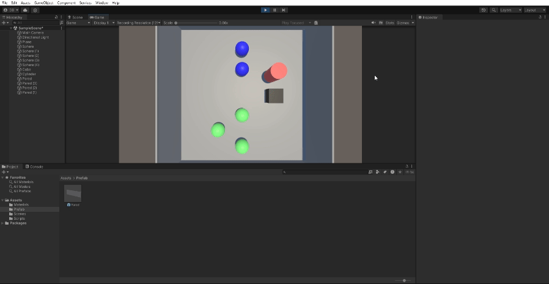
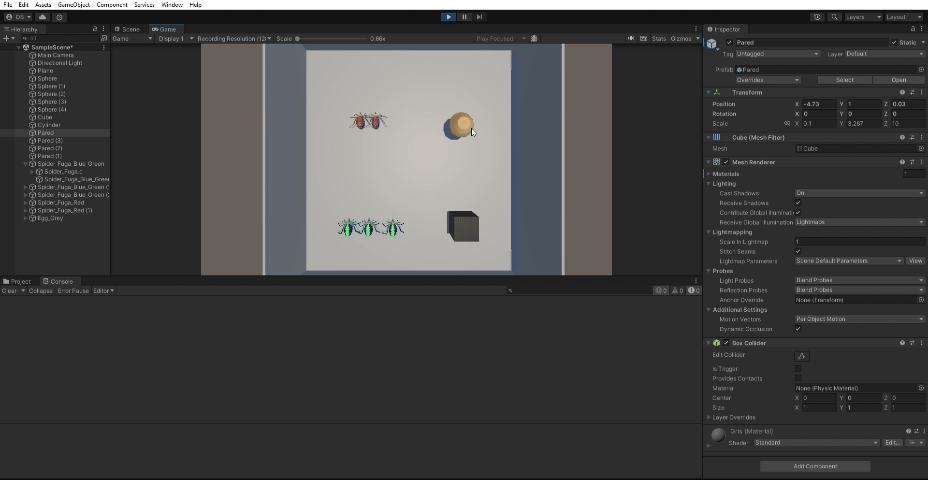
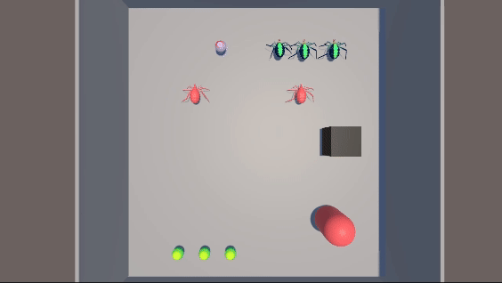
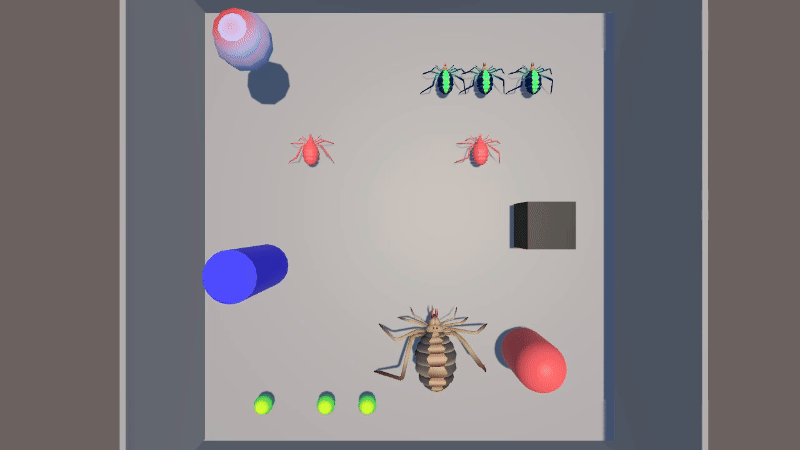
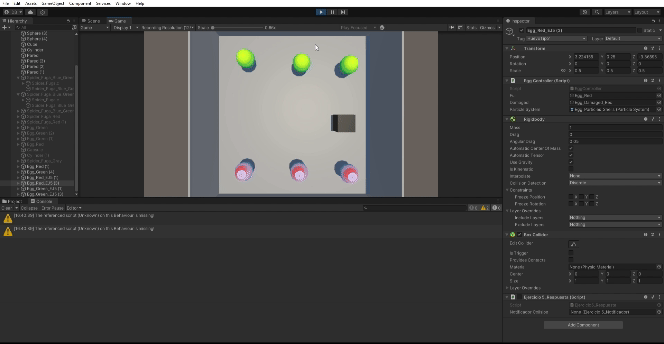
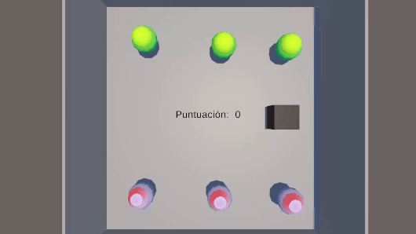
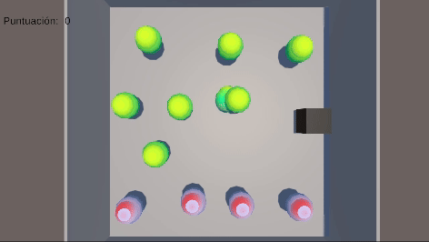

# Delegados, Eventos
## Ejercicios realizados

1. A partir de la escena que has estado utilizando en las últimas prácticas, crea la
siguiente mecánica. Cuando el cubo colisiona con el cilindro, las esferas de tipo 1 se
dirigen hacia una de las esferas de tipo 2 que fijes de antemano y las esferas de tipo
2 se desplazan hacia el cilindro.

    - `Ejercicio1_Movimiento`. Permite al cubo moverse por la escena con la flechas del teclado.
    - `Ejercicio1_Notificador`. Notifica que el cubo ha colisionado con el cilindro e invoca el evento `OnObjectCollision`.
    - `Ejercicio1_RespuestaTipo1`. En respuesta al evento, las esferas de tipo 1 seguirán a una de las esferas de tipo 2 elegida arbitrariamente.
    - `Ejercicio1_RespuestaTipo2`. En respuesta al evento, las esferas de tipo 2 seguirán al cilindro.

  

2. Sustituye los objetos geométricos por arañas para las esferas y huevo para el cilindro que encontrarás en el enlace.

  

3. Adapta la escena anterior para que existan arañas de tipo 1 y de tipo 2, así como diferentes tipos de huevo, tipo 1 y tipo 2:
    - Cuando el cubo colisiona con cualquier araña tipo 2, las arañas en el grupo 1 se acercan a un objeto seleccionado. Cuando el cubo toca cualquier araña del grupo 1 se dirigen hacia los huevos del grupo 2 que serán objetos físico. Si alguna araña colisiona con uno de ellos debe cambiar de color.

    - El script `Ejercicio3_Notificador` será el encargado de invocar el evento `OnObjectCollision`, al cual se le pasa el parámetro "tag" que indicará si ha colisionado con una araña de tipo 1 o 2.
    - En respuesta al evento, se han creado los scripts `Ejercicio3_MoverHaciaObjeto` y `Ejercicio3_MoverHaciaHuevoTipo2`. El primero de estos, se encarga de mover las arañas de tipo 1 hacia un objeto elegido cuando el cubo colisiona con una araña de tipo 2. El segundo script, moviliza las arañas de tipo 1 a un huevo aleatorio de tipo 2, cuando el cubo colisiona con una araña de tipo 1. Asimismo, cuando estos colisionan con el huevo de tipo 2, se aplica el método ChangeColor().

  

4. Cuando el cubo se aproxima al objeto de referencia, las arañas del grupo 1 se teletransportan a un huevo objetivo que debes fijar de antemano.Las arañas del grupo 2 se orientan hacia un objeto ubicado en la escena con ese propósito.

    - Se ha fijado una distancia a partir de la cual el evento `NotificarProximidad` es invocado a través del script `Ejercicio4_Notificador`.
    - Para teletransportar las arañas de tipo 1 se ha usado el script `Ejercicio4_Teletranspote`.
    - Para la rotación de las arañas de tipo 2 al objetivo elegido, se han usado los métodos `Quaternion.LookRotation`, `Quaternion.MoveRotation` y `Quaternion.Slerp` al tratarse de arañas con RigidBody. Esto se ha implementado en el script `Ejercicio4_MirarObjetivo`.

  

5. Implementar la mecánica de recolectar huevo en la escena que actualicen la puntuación del jugador. Las arañas de tipo 1 suman 5 puntos y las arañas de tipo 2 suman 10. Mostrar la puntuación en la consola.

    - Se ha implementado una clase `Puntuacion` y una clase `Notificador` que indica qué tipo de objeto ha colisionado con el cubo y en respuesta pasa como parámetro una cantidad de puntos al evento `NotificarColision`. Dependiendo del tipo de objeto el script `Ejercicio5_Respuesta` sumará una cantidad de puntos u otra al contador de la clase `Puntuacion`.

  

6. Partiendo del script anterior crea una interfaz que muestre la puntuación que va obteniendo el cubo.

    - Se ha crado una interfaz añadiendo un canvas a la escena cuyo subcomponente texto es controlado a través del script `InterfazPuntuacion`, el cual se encargará de actualizar el puntaje.

  

7. Partiendo de los ejercicios anteriores, implementa una mecánica en la que cada 100 puntos el jugador obtenga una recompensa que se muestre en la UI.

    - El notificador en este caso se encarga de invocar al evento `Recompensa100Puntos` cuando el contador de puntos llegue a 100. En este caso, la clase suscriptora `Respuesta_Recompensa` se encargará de desplegar un mensaje de recompensa.
    - Se han modificado los puntos de los huevos de araña tipo 2 (de 10 a 100 puntos), a efectos de mejorar la visualización del funcionamiento del mensaje de recompensa.
    - Para hacer que desaparezca el mensaje de recompensa se ha asignado la telca `R`.

  

8. Genera una escena que incluya elementos que se ajusten a la escena del prototipo y alguna de las mecánicas anteriores.

    - En caso de que el cubo colisione con alguno de los huevos de tipo 1, las arañas de tipo 1 lo seguirán (simulando un ataque por recolectar sus huevos), lo mismo ocurrirá con los huevos de tipo 2. En caso de que el cubo colisione con la araña madre, las arañas líder de cada tipo seguirán al cubo (simulando un ataque). Asimismo, se mantiene el contador de puntos y el sistema de recompensas.

  

9. Implementa el ejercicio 3 siendo el cubo un objeto físico.

    - Ya ha sido implementado de esta forma.