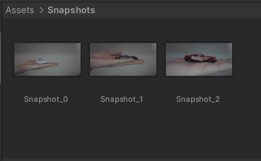

# Práctica: Micrófono y Cámara.
## Descripción

- El objetivo de esta práctica es el uso de componentes de entrada con Unity3D. Los componenetes a usar son la cámara y el micrófono del ordenador o el teléfono móvil.

### Ejercicio 1.

- Para el desarrollo de este ejercicio se han creado dos scripts. El script `Ejercicio1_Mover_hacia_objeto` permite simular el seguimiento de la araña hacia un objetivo específico. Por último, el script `Ejercicio1_Distancia_minima_reproducir_sonido` permite reproducir un sonido a través de los componenetes **AudioClip** y **AudioSource** cuando la araña se encuentre a una distancia X de su objetivo final. El sonido se reproducirá cada **5 segundos** mientras el objeto se encuentre dentro de la distancia establecida.

### Ejercicio 2.

- Se han importado 3 paquetes del Asset Unity Store que permiten simular la escena con una pantalla central y sus respectivos altavoces. Para reproducir el sonido del micrófono se ha desarrollado el scrip `Ejercicio2_Reproducir_sonido_microfono` en el que se usa la tecla R para indicar que queremos empezar a captar el sonido que queremos reproducir a través de los altavoces. Se usan las funciones `Microphone.Start()`, `Microphone.End()` y `AudioSource.Play()` para reproducir el audio grabado.

### Ejercicio 3.

- Se ha modificado la propiedad mainTexture del prefab que simula la pantalla (a través de su Renderer) y se ha igualado al WebCamTexture de la primera cámara encontrada (WebCamTexture(WebCamTexture.devices[0].name)) para reproducir la imagen que capta la cámara a través de su material. A través del método `Input.GetKey()` hemos especificado que iniciaremos la cámara con la tecla S, pararemos la captura con la tecla P y tomaremos una captura del fotograma con la tecla X (y la almacenaremos en el proyecto).

### Ejercicio 4.

### Ejercicio 5.

- En primer lugar, creamos una textura 2D (especificando la anchura y altura de la misma) a la que le pasaremos el frame captado como un bloque de píxeles (a través de la función `SetPixels()`) y finalmente almacenamos la textura con el método `WriteAllBytes()` (especificando la ruta deseada y transformando la textura en PNG con la función `EncodeToPNG()`).

