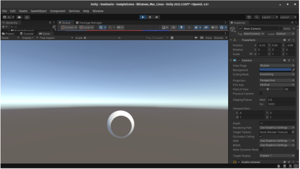
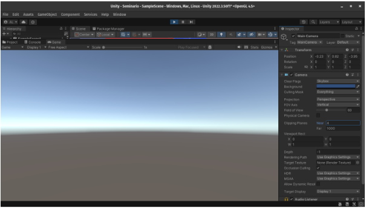
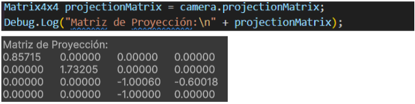
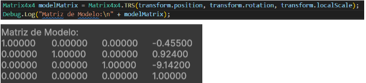
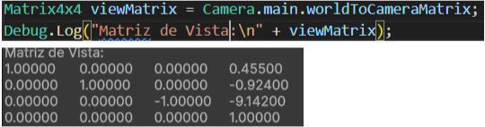
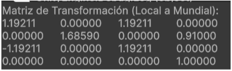

# Seminario: Mundos virtuales. Introducción a la programación de gráficos 3D.

## Integrantes

- Daniel David Sarmiento Barrera (alu0101499208@ull.edu.es)
- Roberto Báez Herrera (alu0101497013@ull.edu.es)
- Adrián Suárez Tabares (alu0101495439@ull.edu.es)
- Adrián Alejandro Padrón López (alu0101480213@ull.edu.es)

## Trabajo realizado

### Qué funciones se pueden usar en los scripts de Unity para llevar a cabo traslaciones, rotaciones y escalados.

En Unity, las transformaciones de traslación, rotación y escalado se pueden manejar utilizando las propiedades y métodos del componente Transform asociado a cada objeto en la escena.

1. Traslación
    - Sin física: transform.Translate(Vector3 traslación)
    - Con física:
        - Rigidbody.addForce(Vector3 traslación)
        - Rigidbody.MovePosition(Vector3 posición)

2. Rotación:
    - Sin física: transform.Rotate(Vector3 angulosEuler)
    - Con física: Rigidbody.MoveRotation(Quaternion rotación)

3. Escalar:
    - transform.localScale = new Vector3(ancho, alto, profundidad);

### Como trasladarías la cámara 2 metros en cada uno de los ejes y luego la rotas 30º alrededor del eje Y?. Rota la cámara alrededor del eje Y 30ª y desplázala 2 metros en cada uno de los ejes. ¿Obtendrías el mismo resultado en ambos casos?. Justifica el resultado.

1. Caso 1:

    ```cs
    // Trasladar la cámara 2 metros en cada eje (x, y, z)
    transform.position += new Vector3(2, 2, 2);
    // Rotar la cámara 30º alrededor del eje Y
    transform.Rotate(0, 30, 0, Space.Self);
    ```

2. Caso 2:

    ```cs
    // Rotar la cámara 30º alrededor del eje Y
    transform.Rotate(0, 30, 0, Space.Self);
    // Trasladar la cámara 2 metros en cada eje (x, y, z)
    transform.position += new Vector3(2, 2, 2);
    ```
No, no se obtiene el mismo resultado en ambos casos. Esto se debe a que, las transformaciones se están aplicando en el sistema de coordenadas del objeto (espacio local), lo cual afecta cómo se interpretan las traslaciones y rotaciones.

### Sitúa la esfera de radio 1 en el campo de visión de la cámara y configura un volumen de vista que la recorte parcialmente.

<p align="center">
  
</p>

### Sitúa la esfera de radio 1 en el campo de visión de la cámara y configura el volumen de vista para que la deje fuera de la vista.

<p align="center">
  
</p>

### Como puedes aumentar el ángulo de la cámara. Qué efecto tiene disminuir el ángulo de la cámara.

El ángulo de visión de la cámara se controla mediante el campo de visión o Field of View (FOV), que se encuentra en el componente Camera.

Cuando reduces el ángulo de la cámara (fieldOfView), el efecto que consigues es un "zoom in" o una visión más cercana y enfocada del área frente a la cámara, por lo que, si disminuimos el ángulo de la cámara esta abarcará menos espacio en el mundo 3D, lo que significa que se verá menos en el entorno en pantalla. Esto puede ser útil para enfocar al jugador en detalles específicos o en un área en particular.

### Es correcta la siguiente afirmación: Para realizar la proyección al espacio 2D, en el inspector de la cámara, cambiaremos el valor de projection, asignándole el valor de orthographic.

Sí, es correcta. Para realizar una proyección ortográfica (que convierte el espacio 3D en 2D), puedes cambiar el modo de proyección de la cámara en Unity a Ortográfica en el Inspector de la cámara. Esto se hace ajustando la propiedad Projection y seleccionando Orthographic. Cuando se asigna este valor, la cámara renderiza la escena en modo ortográfico, en lugar de la proyección perspectiva que es la predeterminada.

### Especifica las rotaciones que se han indicado en los ejercicios previos con la utilidad quaternion.

Un ejemplo de cómo realizar la rotación anterior utilizando la utilizadad quaternion sería la siguiente.

```cs
Vector3 direccionObjetivo = objetoObjetivo.transform.position - transform.position;
Quaternion rotacionObjetivo = Quaternion.LookRotation(direccionObjetivo);
transform.rotation = Quaternion.Slerp(transform.rotation, rotacionObjetivo, 0.1f);
```

### ¿Como puedes averiguar la matriz de proyección en perspectiva que se ha usado para proyectar la escena al último frame renderizado?.

Unity te permite acceder a la matriz de proyección de la cámara directamente a través de la propiedad projectionMatrix de la clase Camera. Esta propiedad devuelve la matriz de proyección actual de la cámara en uso.

### ¿Como puedes averiguar la matriz de proyección en perspectiva ortográfica que se ha usado para proyectar la escena al último frame renderizado?.

En Unity, obtener la matriz de proyección ortográfica utilizada para proyectar la escena en el último frame renderizado es tan sencillo como obtener la matriz de proyección de cualquier cámara (projectionMatrix), ya que Unity te permite acceder directamente a la matriz que la cámara utiliza en el proceso de proyección, ya sea en perspectiva o en ortográfica.

La diferencia clave entre las dos es que en la proyección ortográfica, no existe distorsión de perspectiva: los objetos mantienen su tamaño independientemente de su distancia de la cámara

### ¿Cómo puedes obtener la matriz de transformación entre el sistema de coordenadas local y el mundial?.

Para obtener la matriz de transformación entre el sistema de coordenadas local y el mundial se usaría lo siguiente: transform.localToWorldMatrix 

### Cómo puedes obtener la matriz para cambiar al sistema de referencia de vista.

Para obtener la matriz de vista para poder cambiar el sistema de referencia de vista se haría de la siguiente manera: Camera.main.worldToCameraMatrix

### Especifica la matriz de la proyección usado en un instante de la ejecución del ejercicio 1 de la práctica 1.

<p align="center">
  
</p>

### Especifica la matriz de modelo y vista de la escena del ejercicio 1 de la práctica 1.

- Matriz de modelo:

<p align="center">
  
</p>

- Matriz de vista:

<p align="center">
  
</p>

### Aplica una rotación en el start de uno de los objetos de la escena y muestra la matriz de cambio al sistema de referencias mundial.

<p align="center">
  
</p>

### ¿Como puedes calcular las coordenadas del sistema de referencia de un objeto con las siguientes propiedades del Transform?:  Position (3, 1, 1), Rotation (45, 0, 45)

Con la matriz de transformación del objeto, ya que accede a esas propiedades del transform. Si multiplicamos esta matriz de esta forma, localToWorldMatrix.MultiplyPoint(Vector3.zero) devuelve la posición del objeto en el mundo.

<p align="center">
  
</p>


### Investiga sobre los modelo de iluminación que aplica Unity y resume las relaciones existentes con el modelo explicado en clase.

En unity hay dos modelos de iluminación implementados por defecto:
- Lambert para iluminación difusa
- Blinn-Phong para luz especular

**El modelo Lambert** es un modelo de iluminación difusa utilizado para simular cómo la luz se dispersa de manera uniforme en una superficie mate o sin brillo, como una pared pintada o un suelo de concreto.

Calcula la iluminación basándose en el ángulo entre la dirección de la luz y la normal de la superficie.
    - La intensidad de la luz en la superficie es máxima cuando la luz incide de forma perpendicular y disminuye cuando el ángulo de incidencia es menor, siguiendo la ley del coseno.
    - No hay reflejos especulares (brillo), por lo que la superficie se ilumina uniformemente, resultando en una apariencia suave.
    - Es ideal para objetos que no tienen brillo ni reflejos, ofreciendo un cálculo simple y eficiente.

**El modelo Blinn-Phong** es una extensión del modelo Phong, diseñado para calcular tanto la iluminación difusa como la especular, lo cual es útil para materiales brillantes.

- Divide la iluminación en dos componentes: difusa y especular.
- Difusa: Utiliza el modelo de Lambert para calcular cómo la luz se dispersa en la superficie.
- Especular: Simula el brillo en superficies pulidas o reflectantes, calculando el ángulo entre el  observador y la luz, y la normal de la superficie.
- La reflexión especular se calcula usando el vector de mitad en lugar de la dirección exacta de la reflexión, lo cual reduce el costo computacional.
- Se usa comúnmente en superficies con un acabado brillante, como metal o plástico, ya que puede representar tanto el color difuso como los reflejos especulares.

El modelo de iluminación Lambert es local porque solo considera la dirección de la luz y la normal de la superficie para calcular la dispersión de luz. No tiene en cuenta los reflejos o el rebote de la luz en otros objetos.

El modelo Blinn-Phong también es un modelo de iluminación local, ya que calcula tanto la luz difusa como la especular sólo en función de la posición de la luz y del observador, sin considerar reflejos indirectos de otras superficies. Añade un componente especular que simula el brillo de materiales brillantes, pero siempre en relación con la luz directa y sin iluminación global o rebotes.

Ambos modelos, al ser locales, calculan la luz sólo desde fuentes directas, lo cual simplifica los cálculos y mejora el rendimiento a costa de una menor precisión en escenarios realistas.
No obstante, Unity permite la implementación de modelos de iluminación personalizados con el uso de shaders.


### Indica las funciones de la API de Unity más importantes respecto a la iluminación

1. Clase Light:

    - Light.type: Configura el tipo de luz, como Directional, Point, Spot, o Area.
    - Light.color: Ajusta el color de la luz, que afecta el ambiente y la atmósfera.
    - Light.intensity: Controla la intensidad o el brillo de la luz. 
    - Light.range: Para luces puntuales (Point) y tipo foco (Spot), determina hasta dónde llega la luz.
    - Light.shadows: Configura el tipo de sombras que genera la luz. Puede ser None, Hard, o Soft. Esto controla si la luz proyecta sombras y el tipo de sombras.

2. Iluminación Global (RenderSettings y Lightmapping)
La iluminación global afecta cómo se iluminan los objetos basándose en el entorno y cómo se "rebota" la luz en una escena.

    - RenderSettings.ambientMode: Configura el modo de iluminación ambiental, como Skybox, Gradient o Color. 
    - RenderSettings.ambientIntensity: Ajusta la intensidad de la luz ambiental. 
    - RenderSettings.defaultReflectionMode y RenderSettings.defaultReflectionResolution: Ajustan el modo de reflexión ambiental y la resolución del mapa de cubo que se usa para calcular las reflexiones en los objetos.

3. Materiales y Sombras (Material, Shader)
Los materiales y shaders controlan cómo los objetos responden a la luz y cómo reflejan o absorben la luz en Unity.

    - Material.SetFloat()
    - Material.SetColor()
    - Material.SetTexture()
