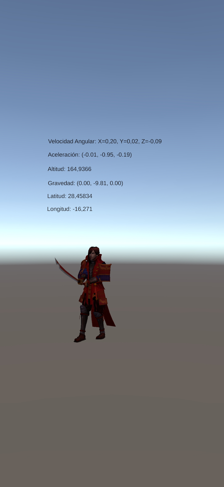

# Práctica: Sensores

- Daniel David Sarmiento Barrera (alu0101499208@ull.edu.es)

## Scripts

- [Ejercicio-1](./Scripts/SensorManager.cs)
- [Ejercicio-2](./Scripts/SamuraiManager.cs)

## Ejercicio 1

## Ejercicio 2

