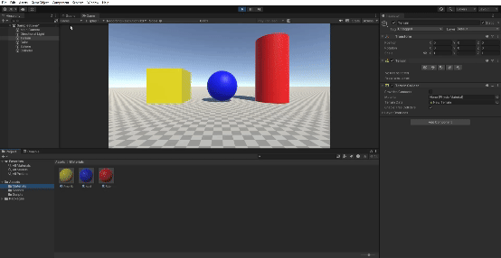
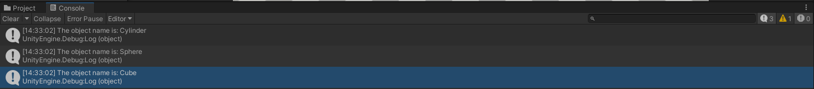

# Proyecto de Escena 3D en Unity

## Descripción del trabajo realizado

El proyecto consiste en realizar una serie de ejercicios con la finalidad de familiarizarnos con el lenguaje de programación C#, así como con todas las herramientas de la interfaz de Unity.

### Ejercicios realizados

1. Script `ColorChanger`. Se ha codificado un script que permite cambiar el color de un objeto cada 120 frames como valor base. Dicho valor puede ser modificado desde el inspector puesto que es un atributo `público` de la clase ColorChanger.

  

2. Script `ShowObjectName`. Se codificó un script para acceder a la propiedad `name` de `gameObject`. Asimismo, se han creado los materiales pertinentes dentro de la carpeta `Materials`.

  

  

3. Script `VectorInfo`. En el script se declaran dos variables públicas de tipo Vector3 que pueden ser accedidas desde el inspector. Asimismo, se han creado los métodos `ShowMagnitude`, `ShowAngle`, `ShowDistance` y `TallestVector`, los cuales proporcionan la información necesaria en la ejecución por consola.

https://github.com/user-attachments/assets/47b844ea-0cab-465b-8790-70c40f40ba34

4. Script `ShowPosition`. Se ha añadido como componente el script al objeto Esfera. Se ha asignado el tag `PositionText` al `TMP_Text` del Canvas para obtener su referencia en el código y asignar la posición de la esfera a la propiedad `text` del mismo.

https://github.com/user-attachments/assets/3dba7711-a18f-4fec-bcf6-4721bba4cbb1

5. Script `DistanceToSphere`. Hemos asignado el tag `Sphere` a la esfera de la escena y hemos obtenido una referencia al mismo. Posteriormente, se ha usado el método Distance que nos permite calcular la distancia entre dos vectores. Finalmente, hemos mostrado el resultado de ambas operaciones por consola.

https://github.com/user-attachments/assets/de86f392-0dbb-4ad8-af94-6bd14fa4deec

6. Script `SpaceToChangePosition`. El método Start inicializa el atributo privado `_positions` en el que se almacenarán las tres posiciones definidas a través de los objetos vacíos `Position1`, `Position2` y `Position3` (que heredan de un objeto vacío padre). El método Update detecta si ha sido presionada la tecla espacio, en cuyo caso se cambia la posición del objeto a la siguiente posición en el vector `_positions` y se actualiza el atributo privado `_currentPosition`.

https://github.com/user-attachments/assets/62dffb29-0850-47d7-9f7f-3264b9e09d45

7. Script `ColorChangerKey`. Definimos un atributo público de tipo `KeyCode` de modo que somos capaces de definir la tecla a presionar para cambiar el color desde el inspector. El script obtiene el componente `Renderer` del objeto y a través del método `Update()` detectamos si ha sido presionada la tecla en cuestión, en tal caso, se llama al método `ChangeColor()`, en el cual accedemos a la propiedad `material.color` y definimos su nuevo valor.

https://github.com/user-attachments/assets/50ba73f8-7601-46c1-97cc-e8be38b8a64f

8. 

