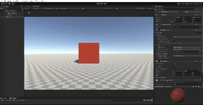

# Proyecto de Escena 3D en Unity

## Descripción del trabajo realizado

El proyecto consiste en realizar una serie de ejercicios con la finalidad de familiarizarnos con el lenguaje de programación C#, así como con todas las herramientas de la interfaz de Unity.

### Ejercicios realizados

1. Script `ColorChanger`. Se ha codificado un script que permite cambiar el color de un objeto cada 120 frames como valor base. Dicho valor puede ser modificado desde el inspector puesto que es un atributo `público` de la clase ColorChanger.

2. 
